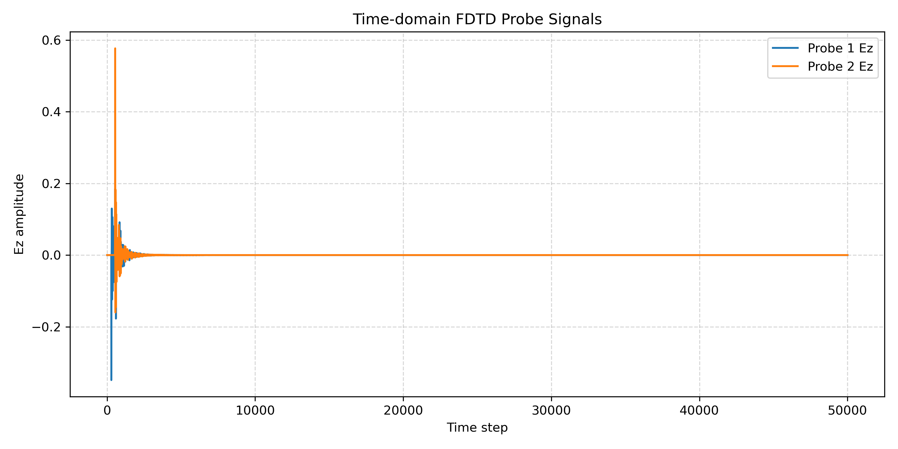

# 1D FDTD OOP Solver

## Project Overview

This project is an object-oriented 1D Finite-Difference Time-Domain (FDTD) electromagnetic solver implemented in C++17.  
It is designed for simulating wave propagation and spectral responses in one-dimensional multilayer optical structures, such as Bragg gratings and Fabry–Perot cavities.

The current version supports TF/SF Gaussian pulse excitation, PML absorbing boundaries, probe-based field recording, OpenMP-accelerated field updates, and CSV output for post-processing.

## Why This Project

The purpose of this project is not only to run a simple FDTD simulation, but to build a small numerical electromagnetic solver framework with clear physical meaning and extensible software structure.

This project demonstrates:

- Understanding of Maxwell-equation-based time-domain field updates.
- Implementation of the Yee-grid scheme for `Ez` and `Hy` fields.
- Use of TF/SF source injection to separate incident, reflected, and transmitted waves.
- Use of PML absorbing boundary layers to reduce artificial boundary reflections.
- Object-oriented C++ design for sources, devices, grids, and simulation control.
- Basic performance optimization using OpenMP and buffered file output.
- Preparation for FFT-based reflection/transmission spectrum extraction.

## Current Features

- 1D FDTD update for `Ez` and `Hy` fields.
- Spatially varying relative permittivity `eps_r`.
- Precomputed update coefficients: `ce_a`, `ce_b`, `ch_a`, and `ch_b`.
- TF/SF Gaussian pulse source.
- PML absorbing boundary implementation.
- Object-oriented device interface.
- Bragg grating structure.
- Fabry–Perot cavity composed of two Bragg mirrors.
- Probe-based time-domain field recording.
- Buffered CSV output.
- Auto shutoff based on field-energy decay.
- OpenMP parallelization for field update loops.
- CMake-based C++17 build system.

## Numerical Method

The solver uses the standard 1D Yee-grid FDTD scheme.  
The electric field `Ez` and magnetic field `Hy` are spatially staggered and updated alternately in time.

The simplified update flow is:

```text
Update Hy
→ Inject H component of TF/SF source
→ Update Ez
→ Inject E component of TF/SF source
→ Record probe signals
→ Check auto shutoff condition

